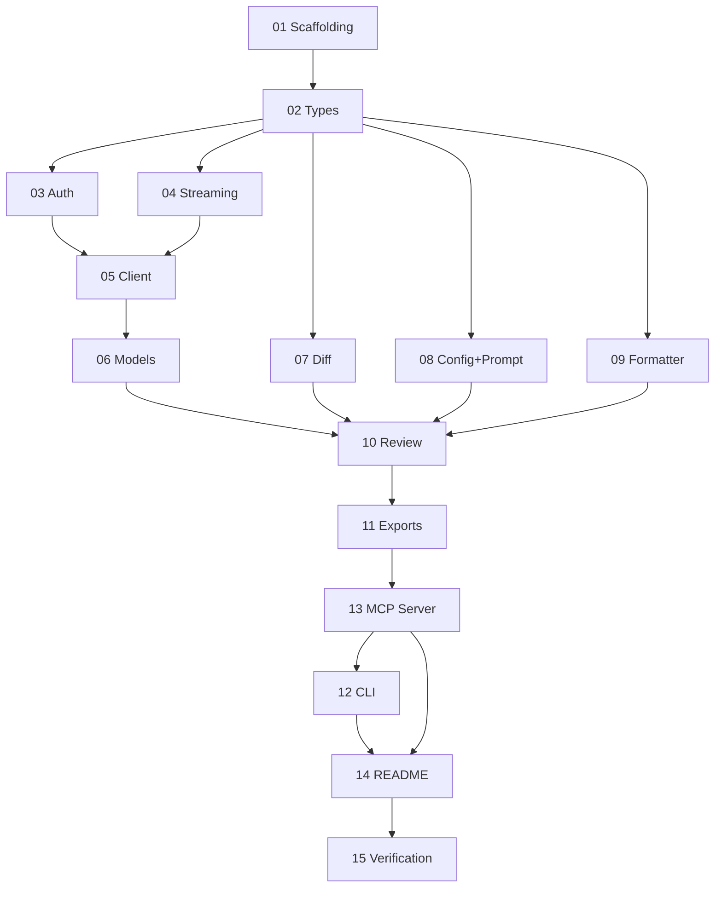

# GitHub Copilot Reviewer — Implementation Plan

> **For agentic workers:** REQUIRED SUB-SKILL: Use superpowers:subagent-driven-development (recommended) or superpowers:executing-plans to implement this plan task-by-task. Steps use checkbox (`- [ ]`) syntax for tracking.

**Goal:** Build a TypeScript CLI tool + MCP server that reviews code changes using GitHub Copilot's chat API.

**Architecture:** Hybrid — shared `lib/` with two thin entry points (`cli.ts`, `mcp-server.ts`). All core logic in `src/lib/`. Both entry points import the library directly; no process spawning.

**Tech Stack:** TypeScript, Node.js >= 18 (built-in fetch), vitest, msw, @modelcontextprotocol/sdk, commander

**Spec:** `docs/spec/` (14 files) — read the relevant spec file before implementing each task.

---

## Task Index

| # | Task | Files | Spec Ref | Dependencies |
|---|------|-------|----------|-------------|
| [01](./01-scaffolding.md) | Project Scaffolding | package.json, tsconfig, .gitignore, LICENSE | [01-architecture](../spec/01-architecture.md) | None |
| [02](./02-types.md) | Shared Types + Error Classes | src/lib/types.ts | [10-error-handling](../spec/10-error-handling.md), [04](../spec/04-copilot-client.md), [03](../spec/03-diff-collection.md), [06](../spec/06-configuration.md), [07](../spec/07-review-orchestration.md) | Task 1 |
| [03](./03-auth.md) | Authentication Module | src/lib/auth.ts | [02-authentication](../spec/02-authentication.md) | Task 2 |
| [04](./04-streaming.md) | SSE Streaming Parser | src/lib/streaming.ts | [04-copilot-client](../spec/04-copilot-client.md) | Task 2 |
| [05](./05-client.md) | Copilot API Client | src/lib/client.ts | [04-copilot-client](../spec/04-copilot-client.md) | Tasks 3, 4 |
| [06](./06-models.md) | Model Management | src/lib/models.ts | [05-model-management](../spec/05-model-management.md) | Task 5 |
| [07](./07-diff.md) | Diff Collection | src/lib/diff.ts | [03-diff-collection](../spec/03-diff-collection.md) | Task 2 |
| [08](./08-config-prompt.md) | Configuration + Prompt | src/lib/config.ts, src/lib/prompt.ts, prompts/default-review.md | [06-configuration](../spec/06-configuration.md), [12-default-prompt](../spec/12-default-prompt.md), [07](../spec/07-review-orchestration.md) | Task 2 |
| [09](./09-formatter.md) | Output Formatter | src/lib/formatter.ts | [11-formatter](../spec/11-formatter.md) | Task 2 |
| [10](./10-review.md) | Review Orchestration | src/lib/review.ts | [07-review-orchestration](../spec/07-review-orchestration.md) | Tasks 5, 6, 7, 8, 9 |
| [11](./11-exports.md) | Public API Exports | src/lib/index.ts | [01-architecture](../spec/01-architecture.md) | Tasks 2-10 |
| [12](./12-cli.md) | CLI Entry Point | src/cli.ts | [08-cli](../spec/08-cli.md) | Tasks 11, 13 |
| [13](./13-mcp-server.md) | MCP Server | src/mcp-server.ts | [09-mcp-server](../spec/09-mcp-server.md) | Task 11 |
| [14](./14-readme.md) | README | README.md | All specs | Tasks 12, 13 |
| [15](./15-verification.md) | Final Verification | — | — | All tasks |

## Dependency Graph

## Parallelization Opportunities

After Task 2 (types), these can run in parallel:
- **Track A:** Task 3 (auth) → Task 4 (streaming) → Task 5 (client) → Task 6 (models)
- **Track B:** Task 7 (diff)
- **Track C:** Task 8 (config+prompt)
- **Track D:** Task 9 (formatter)

Task 10 (review) depends on all four tracks converging.

After Task 11 (exports): Task 13 (MCP) first, then Task 12 (CLI) — CLI dynamically imports MCP server for `--mcp` flag.

## File Map

| File | Responsibility |
|------|---------------|
| `package.json` | Project config, dependencies, scripts, bin |
| `tsconfig.json` | TypeScript compiler config |
| `vitest.config.ts` | Test framework config |
| `.gitignore` | Ignore dist/, node_modules/, etc. |
| `LICENSE` | MIT license |
| `README.md` | Installation, usage, configuration |
| `src/lib/types.ts` | All shared interfaces and error classes |
| `src/lib/auth.ts` | Token resolution + session token exchange |
| `src/lib/streaming.ts` | SSE parser for both API formats |
| `src/lib/client.ts` | Copilot API client (chat + chatStream) |
| `src/lib/models.ts` | Model listing, validation, auto-selection |
| `src/lib/diff.ts` | Diff collection (7 modes) |
| `src/lib/config.ts` | Config loading + 4-layer merge |
| `src/lib/prompt.ts` | Built-in prompt loader + user message assembly |
| `src/lib/formatter.ts` | Output formatting (text/markdown/json/ndjson) |
| `src/lib/review.ts` | Review orchestration pipeline |
| `src/lib/index.ts` | Public API re-exports |
| `src/cli.ts` | CLI entry point |
| `src/mcp-server.ts` | MCP server entry point |
| `prompts/default-review.md` | Built-in opinionated review prompt |
| `test/lib/*.test.ts` | Unit tests for each lib module |
| `test/cli.test.ts` | CLI integration tests |
| `test/mcp-server.test.ts` | MCP server integration tests |
| `test/fixtures/` | Diffs, configs, recorded API responses |

## Approach

- **TDD** — tests before implementation for every module
- **Frequent commits** — one commit per task (test + implementation together)
- **Build order** — follows dependency graph strictly
- **No placeholders** — every step contains actual code or exact commands
