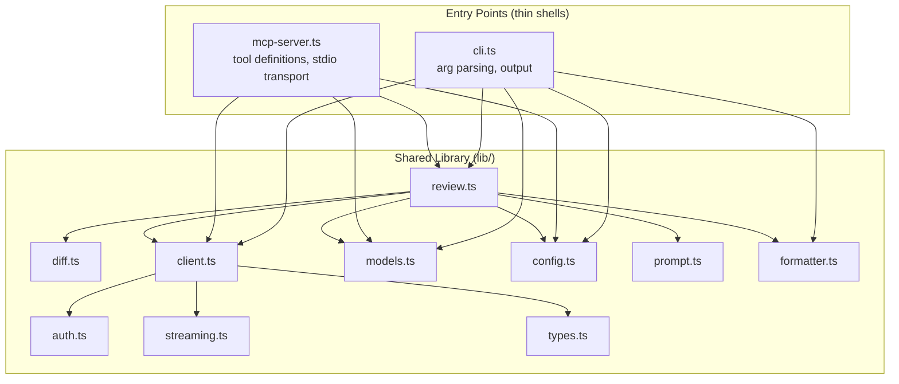
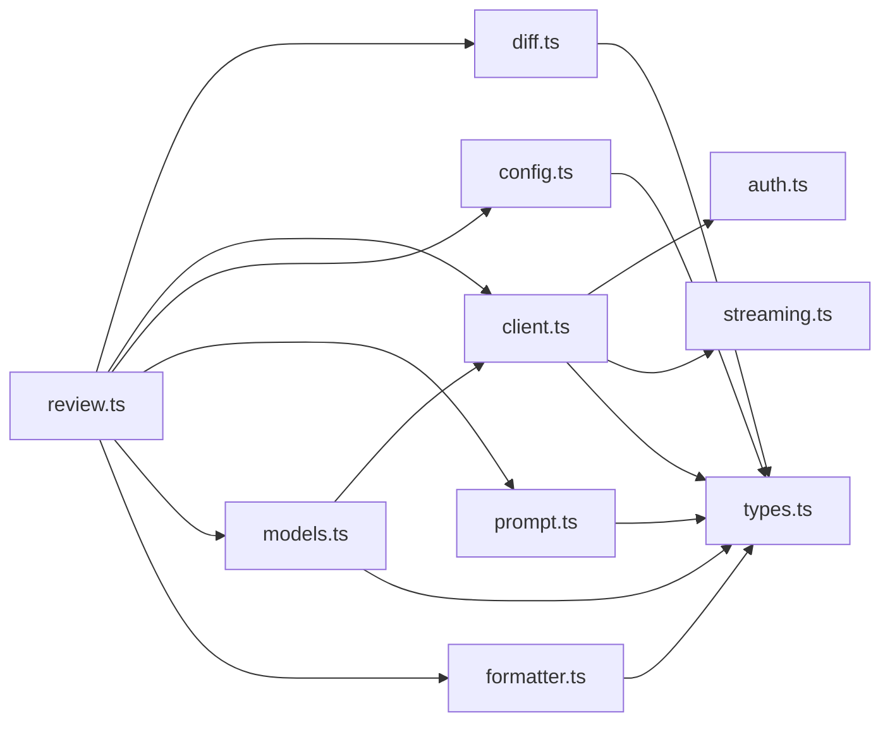

# 01 — Architecture

[Back to Spec Index](./README.md) | Next: [02 — Authentication](./02-authentication.md)

---

## Project Structure

```
github-copilot-reviewer/
├── package.json
├── tsconfig.json
├── LICENSE                        # MIT
├── README.md
├── src/
│   ├── cli.ts                     # CLI entry point
│   ├── mcp-server.ts              # MCP entry point
│   └── lib/
│       ├── index.ts               # public API surface (re-exports)
│       ├── auth.ts                # token resolution
│       ├── client.ts              # Copilot API client
│       ├── diff.ts                # diff collection (7 modes)
│       ├── models.ts              # model listing, auto-selection, caching
│       ├── review.ts              # review orchestration
│       ├── config.ts              # config loading & merging
│       ├── prompt.ts              # built-in prompt + prompt assembly
│       ├── formatter.ts           # output formatting (text/markdown/json)
│       ├── streaming.ts           # SSE parser
│       └── types.ts               # shared type definitions
├── prompts/
│   └── default-review.md          # built-in opinionated review prompt
├── test/
│   ├── lib/                       # unit tests (mirrors src/lib/)
│   ├── cli.test.ts                # integration tests
│   ├── mcp-server.test.ts         # integration tests
│   ├── fixtures/                  # diffs, configs, recorded API responses
│   └── e2e/                       # manual E2E tests
├── .gitignore
├── docs/
│   ├── spec/                      # this specification
│   ├── adr/                       # architectural decision records
│   └── reference/                 # reverse-engineered API docs
└── .copilot-review/               # project-level config (dogfooding)
    ├── config.json
    └── config.md
```

## Hybrid Architecture

> See also: [ADR-002 — Hybrid Architecture](../adr/002-hybrid-architecture.md)

Both entry points import a shared library. Neither shells out to the other.



## Module Boundaries

The `lib/` directory is the contract between the two entry points.

**Rules:**
- `lib/` has zero imports from `cli.ts` or `mcp-server.ts`.
- `lib/` has zero dependencies on `process.argv`, MCP SDK, or any CLI framework.
- `cli.ts` depends on `lib/` + CLI arg parser (`commander` or `yargs`).
- `mcp-server.ts` depends on `lib/` + `@modelcontextprotocol/sdk`.
- `types.ts` defines all shared types — Copilot API shapes, config, errors, results. All modules import it; edges omitted from diagrams for clarity.

## Internal Module Dependencies



## Dependencies

### Runtime

| Package | Purpose |
|---------|---------|
| `@modelcontextprotocol/sdk` | MCP server SDK |
| `commander` or `yargs` | CLI argument parsing (TBD at impl) |

### Dev

| Package | Purpose |
|---------|---------|
| `typescript` | Compiler |
| `vitest` | Test framework |
| `msw` | HTTP mocking |
| `@types/node` | Node.js type definitions |

### Notably Absent

- No `axios`/`node-fetch` — use Node.js built-in `fetch` (available since Node 18).
- No BPE tokenizer library — char/4 heuristic for v1.
- No `chalk`/`ora` — minimal terminal formatting, avoid heavy deps.

## Runtime Requirements

- **Node.js >= 18.0.0** — required for built-in `fetch`. Recommended: 20.x LTS.
- Document in `package.json`: `"engines": { "node": ">=18.0.0" }`

## Package Configuration

```json
{
  "main": "dist/lib/index.js",
  "types": "dist/lib/index.d.ts",
  "bin": { "copilot-review": "dist/cli.js" },
  "files": ["dist/", "prompts/"]
}
```

MCP server is invoked directly via `node dist/mcp-server.js`, not published as a separate bin.

## .gitignore

```
node_modules/
dist/
*.log
.env
```
