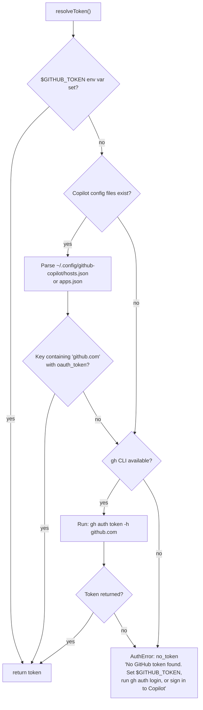
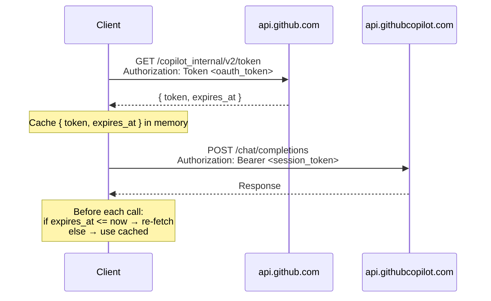

# 02 — Authentication

[Back to Spec Index](./README.md) | Prev: [01 — Architecture](./01-architecture.md) | Next: [03 — Diff Collection](./03-diff-collection.md)

> API details: [Copilot API Reference — Authentication](../reference/copilot-api-reference.md)

---

## Overview

GitHub Copilot uses a two-layer token scheme:

1. **OAuth token** (long-lived) — obtained from local sources
2. **Session token** (short-lived) — exchanged via GitHub API, used for all Copilot requests

## Token Resolution

`resolveToken()` checks sources in priority order. First match wins.



### Source 1: `$GITHUB_TOKEN` Environment Variable

Direct check — `process.env.GITHUB_TOKEN`. Fastest path, commonly set in CI environments.

### Source 2: Copilot Config Files

Locations:
- `~/.config/github-copilot/hosts.json`
- `~/.config/github-copilot/apps.json`

Look for keys containing `github.com` with an `oauth_token` field. These files are created by Copilot editor extensions (VS Code, Neovim, JetBrains).

### Source 3: `gh` CLI

```bash
gh auth token -h github.com
```

Spawned via `child_process.execFile` (not shell-based execution) — no injection risk. Check that `gh` binary exists before attempting.

## Session Token Exchange



**Response shape:**
```json
{
  "token": "<opaque string>",
  "expires_at": 1711234567
}
```

The `token` value is opaque — do not parse it. Cache in memory and check `expires_at` before each API call.

## Public API

The auth module exports a single high-level function:

```typescript
getAuthenticatedHeaders(): Promise<Record<string, string>>
```

Consumers never deal with raw tokens. This function handles the full chain: resolve OAuth token, exchange for session token, return headers with `Authorization: Bearer <session_token>`.

## Error Types

See [10 — Error Handling](./10-error-handling.md) for the full error hierarchy.

| Code | When | Recoverable |
|------|------|-------------|
| `no_token` | All three sources exhausted | No |
| `token_expired` | Session token past `expires_at` | Yes (auto-refresh) |
| `exchange_failed` | Token exchange HTTP error | No |
| `model_auth` | 401 with `authorize_url` — model needs user authorization | No |

## Future Enhancements

> Documented here for reference. Not built in v1.

### Device Flow Authentication

Interactive OAuth for users without existing tokens. Two known client IDs:

| Provider | Client ID | Scope |
|----------|-----------|-------|
| Copilot | `Iv1.b507a08c87ecfe98` | (empty) |
| GitHub Models | `178c6fc778ccc68e1d6a` | `read:user copilot` |

Flow: request device code, user visits URL and enters code, poll for token. See [Copilot API Reference](../reference/copilot-api-reference.md) for full protocol.

### Persistent Token Caching

Cache session tokens to disk to avoid exchange on every CLI invocation. Useful when running multiple reviews in quick succession.
