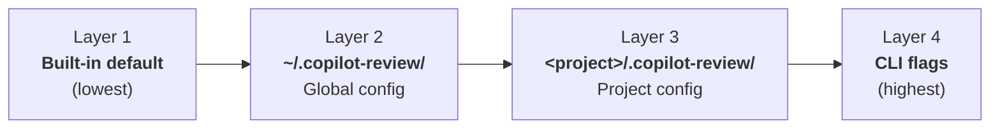

# 06 — Configuration

[Back to Spec Index](./README.md) | Prev: [05 — Model Management](./05-model-management.md) | Next: [07 — Review Orchestration](./07-review-orchestration.md)

> See also: [ADR-003 — Config Layering](../adr/003-config-layering.md)

---

## Four-Layer Precedence



| Layer | Source | Scope |
|-------|--------|-------|
| 1 | `prompts/default-review.md` + hardcoded defaults | Ships with the tool |
| 2 | `~/.copilot-review/config.json` + `config.md` | Personal defaults across all projects |
| 3 | `<git-root>/.copilot-review/config.json` + `config.md` | Project team settings (committed to git) |
| 4 | `--model`, `--format`, `--prompt` flags | One-shot invocation override |

## Config JSON Schema

Shared by global (layer 2) and project (layer 3):

```typescript
interface ConfigFile {
  model?: string;              // model ID or "auto"
  format?: "text" | "markdown" | "json";
  stream?: boolean;
  mode?: "extend" | "replace"; // prompt merge strategy (default: "extend")
  prompt?: string;             // inline text OR relative path to .md file
  defaultBase?: string;        // default base branch (e.g. "main")
  ignorePaths?: string[];      // glob patterns to exclude from diff
}
```

## Resolved Config (output)

After merging all layers, every field is resolved (no optionals):

```typescript
interface ResolvedConfig {
  model: string;
  format: "text" | "markdown" | "json";
  stream: boolean;
  prompt: string;              // final assembled prompt text
  defaultBase: string;
  ignorePaths: string[];
}
```

### Built-in Defaults

```json
{
  "model": "auto",
  "format": "markdown",
  "stream": true,
  "mode": "extend",
  "defaultBase": "main",
  "ignorePaths": []
}
```

## Merge Algorithm

### Structured Settings

`model`, `format`, `stream`, `defaultBase` — higher layer simply replaces lower.

`ignorePaths` — **union** across all layers (deduplicated). This is intentional: global config might exclude `*.lock` files, project config might exclude `vendor/`. Both exclusions should apply simultaneously. This is the one structured setting that merges rather than replaces.

### Prompt (the Review Instructions)

The prompt is the only field with merge semantics, controlled by the `mode` field:

| Mode | Behavior |
|------|----------|
| `"extend"` (default) | Layer's prompt is **appended** to the accumulated prompt from lower layers |
| `"replace"` | Layer's prompt **replaces** everything below it. Higher layers can still extend on top. |
| CLI `--prompt` | Implicit replace — flag value becomes the entire prompt. |

**Concatenation order (when all layers use "extend"):**

```
Built-in default prompt (prompts/default-review.md)

## Additional Instructions (Global)
<global config.md or config.json prompt>

## Project Instructions
<project config.md or config.json prompt>
```

**Example with replace:**

If project config sets `"mode": "replace"`:
```
<project prompt only>
```

If project uses `"replace"` but a CLI `--prompt` is also provided:
```
<CLI prompt only>   (CLI --prompt is always implicit replace)
```

## Prompt Resolution Within a Layer

Each layer has two possible prompt sources:

1. `config.json` → `prompt` field (inline text OR relative path to a `.md` file)
2. `config.md` (standalone file)

Resolution:
- If `config.json` exists and has a `prompt` field → use it (resolve path if applicable)
- Else if `config.md` exists → use its contents
- Else → layer contributes no prompt

### Distinguishing Inline Text from File Path

The `prompt` field can be inline text, a relative path, or an absolute path. Heuristic:

1. If the value ends with `.md` and the file exists (resolved relative to the config directory) → treat as file path
2. If the value starts with `/` (Unix) or a drive letter (Windows) and the file exists → treat as absolute file path
3. Otherwise → treat as inline text

If the value looks like a path but the file doesn't exist → `ConfigError { code: "prompt_not_found" }`.

### `--config` Flag Scope

`--config <path>` **replaces the project config layer only**. Global config still loads. The path can be:
- Absolute path to a directory (looks for `config.json`/`config.md` inside)
- Absolute path to a `.json` or `.md` file
- Relative path (resolved from cwd)

## Edge Cases

| Scenario | Behavior |
|----------|----------|
| Config directory not found | Skip silently (not an error) |
| `config.json` malformed | `ConfigError` with file path and parse details |
| `config.json` exists, `config.md` doesn't | Use `config.json` prompt field (if present) |
| `config.md` exists, `config.json` doesn't | Use `config.md` as prompt; all other settings from lower layers |
| Both missing at a layer | Layer contributes nothing |
| Git root detection fails | Skip project layer |
| `prompt` field is a path that doesn't exist | `ConfigError { code: "prompt_not_found" }` |
| `config.md` is empty (0 bytes) or whitespace-only | Treated as "no prompt contribution" (same as missing) |
| Multiple layers use `"mode": "replace"` | Each replace discards everything below; higher layer wins |

## Public API

```typescript
interface CLIOverrides {
  prompt?: string;              // --prompt flag
  model?: string;               // --model flag
  format?: "text" | "markdown" | "json";  // --format flag
  stream?: boolean;             // --stream / --no-stream flag
  config?: string;              // --config flag (path to override project config layer)
}

loadConfig(cliOverrides?: CLIOverrides): ResolvedConfig
```

See [10 — Error Handling](./10-error-handling.md) for `ConfigError` types.

## Platform Considerations

### Path Normalization

All file paths are normalized to forward slashes internally (even on Windows) for consistency with git output:
- `ignorePaths` globs should use forward slashes: `dist/**/*.js` (not `dist\**\*.js`)
- Prompt file paths in `config.json` can use either format; both are normalized
- `~` in paths is expanded using `os.homedir()` in Node.js (not shell expansion) — applies to config paths, Copilot config file paths, and `--config` flag

### Monorepo Projects

Project config is loaded from `<git-root>/.copilot-review/`. In monorepos (git root above the project directory), all services share the same project config. For per-service config, use `--config` flag or rely on global config for per-developer overrides.
