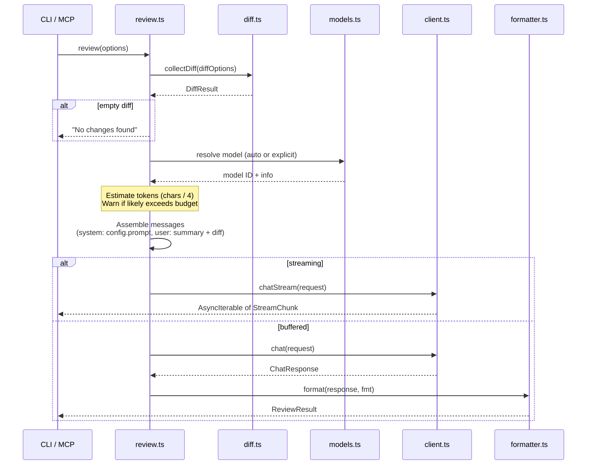

# 07 — Review Orchestration

[Back to Spec Index](./README.md) | Prev: [06 — Configuration](./06-configuration.md) | Next: [08 — CLI](./08-cli.md)

---

## Overview

`review.ts` is the central coordinator — it connects [diff](./03-diff-collection.md), [config](./06-configuration.md), [client](./04-copilot-client.md), [models](./05-model-management.md), and [formatter](./11-formatter.md) into a single review pipeline.

## Pipeline



## Public Interface

```typescript
/** Buffered — returns complete result (used by MCP, JSON output) */
review(options: ReviewOptions): Promise<ReviewResult>

/** Streaming — yields chunks (used by CLI with text/markdown) */
reviewStream(options: ReviewOptions): AsyncIterable<string>
```

```typescript
interface ReviewOptions {
  diff: DiffOptions;           // passed to diff.ts
  config: ResolvedConfig;      // from config.ts
  model?: string;              // override (or "auto")
}

interface ReviewResult {
  content: string;             // formatted review text
  model: string;               // actual model used
  usage: { totalTokens: number };
  diff: DiffResult;            // metadata about what was reviewed
  warnings: string[];          // token budget, binary files, etc.
}
```

## Step-by-Step

### 1. Collect Diff

Call `collectDiff(options.diff)`. If the diff is empty, return early with a "no changes found" result — don't waste an API call.

### 2. Resolve Model

- If explicit `--model` → validate against `models.listModels()` (see [05 — Model Management](./05-model-management.md))
- If `"auto"` → call `models.autoSelect()`

### 3. Check Token Budget

Estimate: `(systemPrompt.length + diff.raw.length) / 4` (chars / 4 heuristic).

Compare against `maxPromptTokens` from the resolved model (see [05 — Model Management](./05-model-management.md)):

- If estimate < 80% of `maxPromptTokens` → proceed silently
- If estimate >= 80% → **warn** (don't block). Warning includes:
  - File list with per-file sizes
  - Suggestion: split review by file, or use a model with larger context

No truncation — the user decides. If Copilot's API rejects for token limit, that error propagates naturally.

> No BPE tokenizer in v1. The char/4 heuristic is imprecise — better to let the API reject than to falsely block a review that would have fit.

### 4. Assemble Messages

**System message:** `config.prompt` (assembled by [config.ts](./06-configuration.md)).

**User message:**

```markdown
Review the following changes.

## Summary
Files changed: 5
Insertions: +120, Deletions: -45

## Diff
```diff
<raw diff content>
```
```

### 5. Call Copilot

- `stream: true` → `client.chatStream(request)` → yield chunks to caller
- `stream: false` → `client.chat(request)` → return complete response

### 6. Format Output

Pass response through [formatter](./11-formatter.md) with the configured format. Only applies to the buffered path — streaming output is written directly.

## `ignorePaths` Application

`ignorePaths` from config is applied before step 1 — filtered files never enter the diff sent to Copilot.
