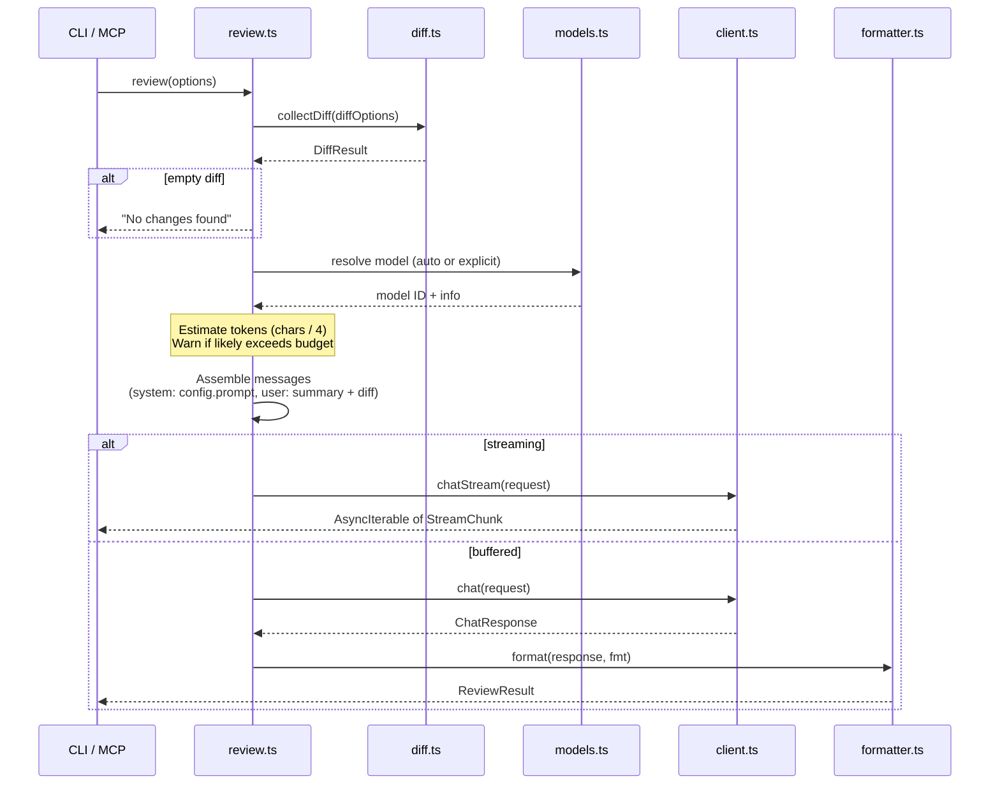

# 07 — Review Orchestration

[Back to Spec Index](./README.md) | Prev: [06 — Configuration](./06-configuration.md) | Next: [08 — CLI](./08-cli.md)

---

## Overview

`review.ts` is the central coordinator — it connects [diff](./03-diff-collection.md), [config](./06-configuration.md), [client](./04-copilot-client.md), [models](./05-model-management.md), and [formatter](./11-formatter.md) into a single review pipeline.

## Pipeline



## Public Interface

```typescript
/** Buffered — returns complete result (used by MCP, JSON output) */
review(options: ReviewOptions): Promise<ReviewResult>

/** Streaming — returns tuple with stream + metadata (used by CLI with text/markdown) */
reviewStream(options: ReviewOptions): Promise<{
  stream: AsyncIterable<string>;
  warnings: string[];
  diff: DiffResult;
  model: string;
}>
```

```typescript
interface ReviewOptions {
  diff: DiffOptions;           // passed to diff.ts
  config: ResolvedConfig;      // from config.ts
  model?: string;              // override (or "auto")
}

interface ReviewResult {
  content: string;             // formatted review text
  model: string;               // actual model used
  usage: { totalTokens: number };
  diff: DiffResult;            // metadata about what was reviewed
  warnings: string[];          // token budget, binary files, etc.
}
```

## Step-by-Step

### 1. Collect Diff

Call `collectDiff(options.diff)`. If the diff is empty, return early with a "no changes found" result — don't waste an API call.

### 2. Resolve Model

- If explicit `--model` → call `models.validateModel(id)` to verify it exists and get `ModelInfo`
- If `"auto"` → call `models.autoSelect()` to get model ID, then call `models.validateModel(id)` to get `ModelInfo` (needed for `maxPromptTokens` in step 3)

Both paths produce a `ModelInfo` object with token limits for budget checking.

### 3. Check Token Budget

Estimate: `(systemPrompt.length + diff.raw.length) / 4` (chars / 4 heuristic).

Compare against `maxPromptTokens` from the resolved model (see [05 — Model Management](./05-model-management.md)):

- If estimate < 80% of `maxPromptTokens` → proceed silently
- If estimate >= 80% and < 100% → **warn** (don't block). Warning includes:
  - File list with per-file sizes
  - Suggestion: split review by file, or use a model with larger context
- If estimate >= 100% of `maxPromptTokens` → **fail** with `ReviewError { code: "diff_too_large" }`. Don't waste an API call that will certainly be rejected.

No truncation — the user decides how to reduce the diff (filter with `ignorePaths`, use a smaller diff mode, or pick a larger-context model).

> No BPE tokenizer in v1. The char/4 heuristic is imprecise — better to let the API reject than to falsely block a review that would have fit. The 100% hard limit is a safeguard only for clearly impossible cases.

### 4. Assemble Messages

**Message ordering** (per API reference): system prompt → context data → conversation history → current user prompt. For v1 single-turn reviews, this simplifies to system + user. Future multi-turn tool loops must preserve this full ordering.

**System message:** `config.prompt` (assembled by [config.ts](./06-configuration.md)). This is always a single concatenated string — config.ts handles multi-layer assembly. For Chat Completions, it becomes one `role: "system"` message. For Responses API, it goes in the `instructions` field.

**User message:**

```markdown
Review the following changes.

## Summary
Files changed: 5
Insertions: +120, Deletions: -45

## Diff
```diff
<raw diff content>
```
```

### 5. Call Copilot

- `stream: true` → `client.chatStream(request)` → yield chunks to caller
- `stream: false` → `client.chat(request)` → return complete response

### 6. Format Output

Pass response through [formatter](./11-formatter.md) with the configured format. Only applies to the buffered path — streaming output is written directly.

## prompt.ts — Prompt Utilities

`prompt.ts` provides two utility functions used by the pipeline. It is NOT responsible for the 4-layer prompt merge — that's [config.ts](./06-configuration.md)'s job.

```typescript
/** Load the built-in default review prompt from prompts/default-review.md */
loadBuiltInPrompt(): string

/** Format the user message with diff summary and content */
assembleUserMessage(diff: DiffResult): string
```

**Division of responsibility:**
- **config.ts** produces `ResolvedConfig.prompt` (the system prompt) by merging 4 layers. It calls `prompt.loadBuiltInPrompt()` for Layer 1.
- **prompt.ts** provides `loadBuiltInPrompt()` (disk I/O) and `assembleUserMessage()` (formatting).
- **review.ts** calls `config.prompt` for the system message and `prompt.assembleUserMessage(diff)` for the user message.

## `ignorePaths` Application

`review.ts` extracts `config.ignorePaths` and passes it to `collectDiff()` via `DiffOptions.ignorePaths`. Filtering happens inside `diff.ts` as post-processing — filtered files never enter the diff sent to Copilot.

## Streaming Warnings

`reviewStream()` returns a tuple so callers can access warnings without stderr coupling:

```typescript
reviewStream(options: ReviewOptions): Promise<{
  stream: AsyncIterable<string>;
  warnings: string[];
  diff: DiffResult;
  model: string;
}>
```

Warnings are computed in steps 1-3 (before the stream starts). The CLI emits them to stderr before streaming content to stdout.

## Empty Response Handling

If Copilot returns an empty `content` string (no findings), this is NOT an error:
- Exit code: 0 (no HIGH severity findings detected)
- Formatter outputs normally with empty findings section
- A note "Provider returned no findings." is added to `warnings` array

## Logging

When `--verbose` is set or `DEBUG=llm-review` env var is present:
- Log resolved config (with token values redacted)
- Log auth token source and expiry time
- Log API request URL, method, and headers (with Authorization redacted)
- Log response status code and rate limit headers
- Log git commands executed
- All debug output goes to stderr.
